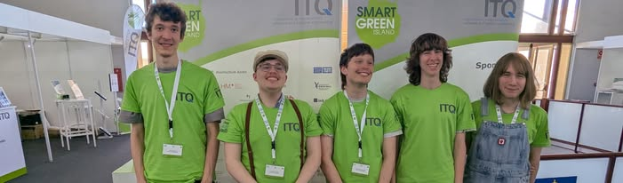
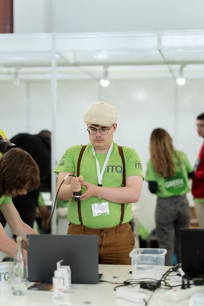
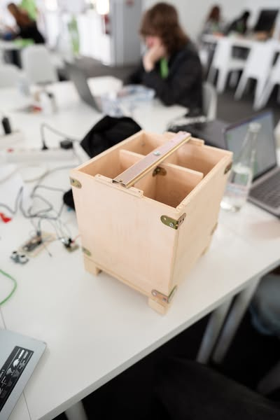
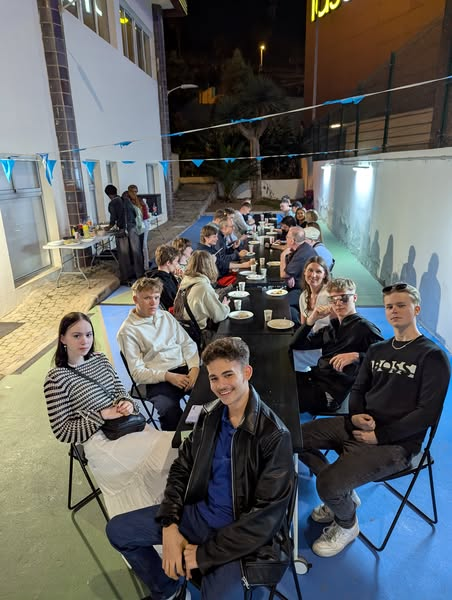
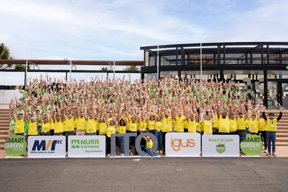
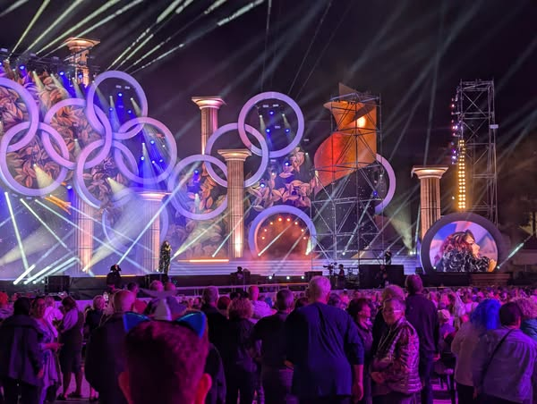

# Smart Green Island Makeathon

Nemendur af Tölvubraut; Arnar, Sindri, Þórbergur, Kristinn og Mateusz ásamt tveimur kennurum; Eiríkur og Gunnar fóru á dögunum til Las Palmas, Kanarí með styrk frá Erasmus+ til að taka þátt í [Smart Green Island Makeathon](https://www.itq.de/en/smart-green-island-makeathon/) með yfir 500 þátttakendum frá skólum víðsvegar frá meira en 50 löndum. Markmiðið með viðburðinum er að vinna í hópum að lausnum (frumgerð) til að gera Kanarí eyjuna sjálfbæra með notkun tækni á aðeins fjórum dögum, [kynningarmyndband](https://www.instagram.com/reel/DHOwAFFO1eJ/?utm_source=ig_web_copy_link&igsh=MzRlODBiNWFlZA%3D%3D).

Við vorum einnig í samvinnu með kennurum og nemendum frá IES El Rincón (skóli í Las Palmas), BBS Jever (Þýskaland) og ESMT (Senegal) að öðru verkefni ([CEIS](https://docs.google.com/document/d/1D7Xh2krgE6D62DElUn6B_B4Iql9CIagkZLHeTSLy7kk/edit?tab=t.0#heading=h.ylsuvf890mso)) tveimur dögum fyrir viðburðinn sem IES EL Rincón hélt svo áfram með.

Okkar nemendur unnu að lausn (e. Smart Waste Management Solution) sem snéri að því að greina rusl með e. machine learning og myndavél, skynjara til vita hvenær ruslatunna er full og mótor sem snéri flokkunarhólfin. Hægt var að sjá svo með vefappi hvar ruslatunnur væru staðsettar á korti og hvenær þær voru orðnar fullar.

Þetta var fróðleg og skemmtileg reynsla fyrir okkar nemendur sem stóðu sig með sóma. Það skemmdi heldur ekki fyrir að það var Carnival á meðan dvöl okkar stóð yfir.

Takk fyrir okkur!

#### Hvað er Makeathon?
Heitið „MAKEATHON“ kemur frá samsetningunni af „MAKE“ og „MARATHON“. Þetta er viðburður þar sem þátttakendur í liðum (úr ólíkum fræðasviðum) verja nokkrum dögum saman í að skapa, forrita, þróa, hanna og kynna hugbúnaðar- og vélbúnaðarverkefni (frumgerð) sem þeir byggja frá grunni byggt á vandamáli sett fram af [styrktaraðilum](https://www.itq.de/wp-content/uploads/2025/03/SMART_GREEN_ISLAND_MAKEATHON_2025_Overview_Industry_Challenges.pdf) eða innan þátttökuliðanna sjálfra.

 

